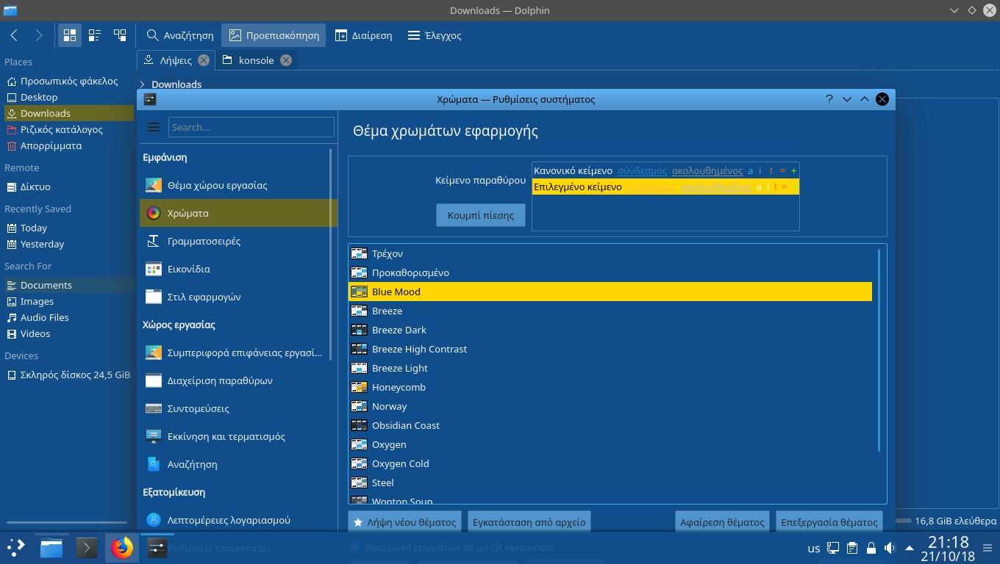

# Blue Mood colorscheme for KDE Plasma 5

An implementation of [emacs's Blue Mood theme's](https://emacsthemes.com/themes/blue-mood-theme.html) colors for KDE Plasma 5.

# Installation & Activation

In the system settings, go to the colors tab, select `Install from file` and select from the load dialog the `BlueMood.colors` file. Alternatively, place said file in `~/.local/share/color-schemes`. Afterwards, select the `Blue Mood` item from the list of colorschemes and select `Apply` to apply the colorscheme.

## Usage note

For optimal results, use the light Breeze theme, as that one uses the dominant color of the used colorscheme for the taskbar and start menu, and thus this way you'll have the Blue Mood colors in these places as well.
